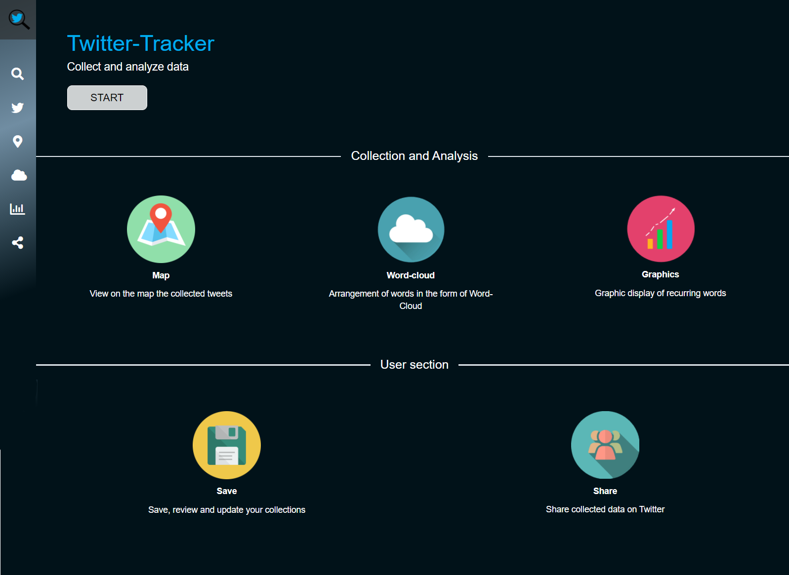
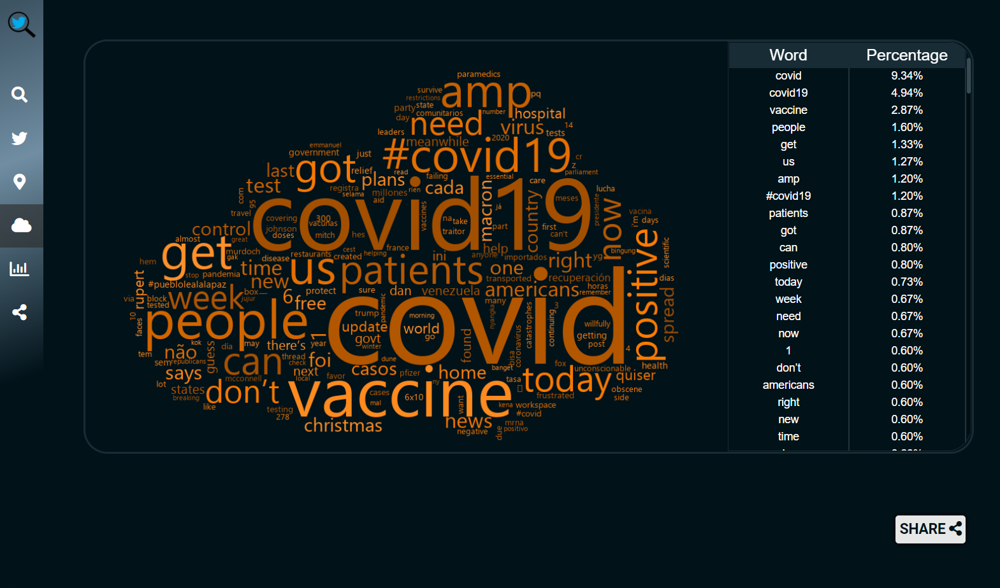
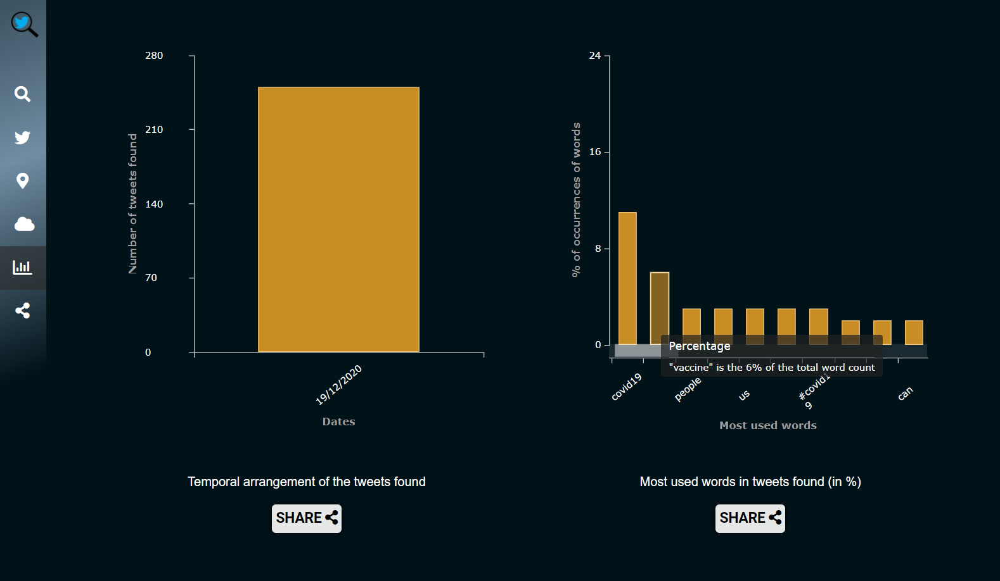

# Twitter-Tracker

Twitter-tracker is useful for collecting published tweets from around the world and viewing them in various representations.



### Table of Contents
- [Get started](#get-started)
- [Usage](#usage)
- [Libraries](#libraries)
- [Authors](#authors)

## Get started
To use this application a Twitter Developers account is needed, in order to get the tweets and for posting to your account. You can go to [Twitter site](https://developer.twitter.com/en/apply-for-access) to get your codes and get started.
You also need a Google Maps Developer account to use the Map functionalities. Get [here](https://developers.google.com/maps/documentation?hl=en).

When you're ready, insert your codes replacing 'YOUR_API_KEY','YOUR_TOKEN' and 'YOUR_SECRET_TOKEN' in these files:
* index.html, line 28 (Google Maps API)
* map.py, line 34 (Google Maps API)
* twitter.py, line 7-10 (Twitter API)

```
#go to the folder with 'requirements.txt' file and prompt this command:

pip install -r requirements.txt 

#Every python library you need is installed. To launch the server run:

python application.py 
```
You can find the application at 'localhost:5000' on every browser.


## Usage
The application consists of 6 components accessible through the sidebar:
- [Search](#search)
- [Streaming and Results](#streaming-and-results)
- [Map](#map)
- [Word-Cloud](#word-cloud)
- [Graphics](#graphics)
- [Post](#post)

### Search 
In this component it is possible to insert the filters that will be used for the query to be submitted to the Twitter API(v.1). It can be selected:
* A keyword to find within the tweets (it works with hashtags too).
* A user to search for tweets.
* A point of interest in which to search for tweets.
* A drawing circle, to find the tweets enclosed in this area.
* Coordinates and circle radius of the area in which to search for tweets.
* A checkbox to find only tweets with images.
* A checkbox to find only geolocated tweets.
Completed the compilation of the desired fields, it is possible to start the search and you are automatically redirected to the '**Results**' component.

There's a section from which it is possible to search for a Twitter trend in streaming or normal search mode.

### Streaming and Results
This component is meant to display cascading tweets; a maximum of 500 tweets per search are shown but there are no limits for streaming option and for uploading collections.
It is possible to extend the tweets in *embedded* appearence through the 'show' button, or by clicking on them from mobile devices. The labels with the filters selected are displayed, with the opportunity to remove them for repeating the search with less parameters. The search results can be saved in a collection which can be renamed, deleted and expanded by the appropriate section.
It can be decided to show only the images of the tweets, where existing, through the *Display images* switch.


### Map 
This section is entirely based on the visualization of the geolocated tweets on the map. If a tweet contains multiple media, the first will be displayed instead of the default marker.

<!--- Così le immagini sono centrate sotto al paragrafo, ma il tag center in teoria è deprecato da HTML4, quindi non ottimo
### Word-Cloud 

Here a word-cloud of the most common words, within the search results, is drawn, with a legend pointing out the frequency percentages of each word.

<center></center>
                         
### Graphics

Through this component it can be viewed 2 graphics. The first shows the number of found tweets published every day of the last week, the second represents the frequency of words used in tweets.

<center></center>

-->

### Word-Cloud 


Here is drawn a word-cloud of the most common words, within the search results, with a legend pointing out the frequency percentages of each word. A word-cloud shows a snapshot of the frequencies at that moment and with the selected tweets, even a small change in the parameters of research (like the number of tweets) can drastically change it!

<br><br><br><br><br>
                            
### Graphics


This component shows 2 key graphics. The first shows the number of found tweets published during each day of the last week, the second represents the frequency of words used in tweets. If the searched topic is heavily tweeted about, it is possible that the first graph will show just one day, the current one.
<br><br><br><br><br><br><br><br>

### Post


There is the possibility of automatically posting on your Twitter account(it must be your developer account) through the SHARE button inserted in the **Map**, **Word-Cloud** and **Graphics** components. A preview of the image that will be posted, will be shown in the modal, where you can set some parameters. When automatic posts have been activated, they will show up in this component and can be deleted. (Obviously every time the server is turned off all automatic posts are lost)


## Libraries
The Server-side part of the application has been developed with flask. We have used tweepy to simplify the use of the Twitter API. 

Twitter API - tweepy: https://www.tweepy.org/

Server-Side Routing - flask: https://flask.palletsprojects.com/en/1.1.x/


If you want to see the running application go to https://flask-env.eba-snhy2wnm.eu-west-3.elasticbeanstalk.com/#/. We use the AWS web hosting service to deploy this application.

## Authors

This project has been developed as part of 'Software Engineering' course at the University of Bologna;<br>
all the code has been been written by: *Nicolò Buscaroli*, *Gabriele Fogu*, *Sofia Gavanelli*, *Erika Lena*, *Daniele Morotti*, *Dario Mylonopoulos*.

Contact details:
- https://github.com/Busca99
- https://github.com/HowlHowlHowl
- https://github.com/sofiagavanelli
- https://github.com/erikalena
- https://github.com/DanieleMorotti
- https://github.com/ramenguy99

Please let us know if you have any further questions or any kind of issues.

[Back To The Top](#twitter-tracker)
